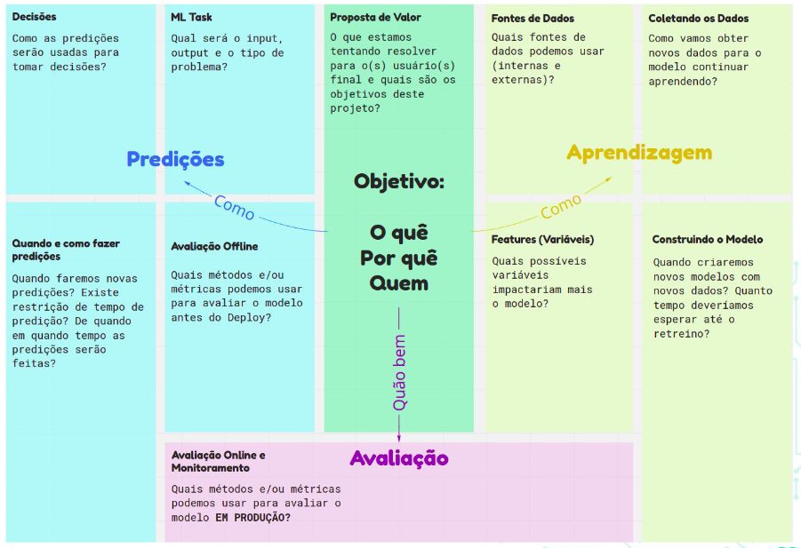

<p align="center">
   <a href='https://jonasaacampos.github.io/portfolio/'>
      
      </a>
</p>

<h1>CRISP-DM</h1>


<h2>Anotações para auxílio de execução de um projeto de Data Science usando o CRISP-DM</h2>


> Checklist e anotações para entrega de projetos de machine learning. 

**In God we trust, all others must bring data.** (W. Edwards Deming)

-----------

[](https://jonasaacampos.github.io/portfolio/)
[](https://www.linkedin.com/in/jonasaacampos)


- [Base teórica](#base-teórica)
  - [Data Mining](#data-mining)
- [Frameworks para Cicência de Dados](#frameworks-para-cicência-de-dados)
  - [CRISP-DM](#crisp-dm)
  - [Exemplo de Tipos de problemas na mineração](#exemplo-de-tipos-de-problemas-na-mineração)
  - [Machine Learning Canvas](#machine-learning-canvas)
- [Casos de Uso](#casos-de-uso)
- [References](#references)
- [Cont(r)ate-me 📫:](#contrate-me-)


<details>
<summary>Preparação do ambiente</summary>

### Preparação do ambiente

#### IDEs utilizada

 - VSCode

#### Criar ambiente virtual

- Command Pallet (ctrl + shift+ p)
- Python: Create Environment > Venv > Python Version (3.12)'

#### Ativar .venv

In VsCode terminal, alterar a política de execução de scripts para ativar o ambiente virtual.

```bash
Set-ExecutionPolicy Unrestricted -Scope Process

# ativar ambiente virtual
.\.venv\Scripts\activate

```

</details>

## Base teórica

> Blockchain é uma escolha. Quem a adota possui um diferencial. Ser _data driving_ não é uma esolha. Não existe como fugir disso.

Ciência de dados tem por objetivo encotnrar valor em um conjunto de dados.

### Data Mining

Visa extrair dados e padrões dos dados, utilizando-se de:

- Machine Learning
- Estatística
- Banco de dados

## Frameworks para Cicência de Dados

- KDD (Knowledge Discovery in Database). Principal objetivo é extratir conhecimento de grandes bases de dados
- Semma -  Foco em criar modelos de mineração
- ASUM-DM (Analytics Solutions Unified Method for Data Mining)
- CRISP-DM (Cross Industry Standard Process for Data Mining). Criado em 1996, é agnóstico e o mais utilizado hoje em dia.


### CRISP-DM


[What is CRISP DM?](https://www.datascience-pm.com/crisp-dm-2/)

1. Business understanding – What does the business need?
   1. Delimitação do escopo
      1. Background do projeto (mapa geral do projeto)
      2. Objetivos de negócio
      3. Critérios de sucesso
   2. Avaliação da Situação
      1. Inventário de recursos
      2. Requisitos, premissas, restrições
      3. Riscos e contingências
      4. Terminologias
      5. Custos e benefícios
   3. Determinar objetivos da mineração de dados
      1. Definir meta de mineração (critério técnicos do objetivo de negócio)
      2. Critérios de sucesso de mineração (use um benchmark de mercado)
   4. Produzir um plano de projeto
      1. Plano de projeto
      2. Avaliação inicial de ferramentas e técnicas
2. Data understanding – What data do we have / need? Is it clean?
   1. Coleta inicial dos dados
      1. Relatório inicial dos dados (de onde os dados vieram, como foram coletados, quais as dificuldades da coleta)
   2. Descrição dos dados
      1. Relatório descritivo dos dados
   3. Exploração dos dados
      1. Relatório exploratório dos dados
   4. Verificação da Qualidade dos dados
      1. Relatório de qualidade (problemas e possíveis soluções)
3. Data preparation – How do we organize the data for modeling?
   1. Dataset e Data Desccription
      1. Selecionar dados (quais atributos, features (colunas) e registros(linhas) fazem sentido). Escrever um relatório que justifique a inclusão/exclusão dos dados.
      2. Limpar dados (fazer relatório de limpeza)
      3. Construir data (técnicas para criação de novas features)
      4. Integrar dados
      5. Formatar dados (não muda o significado, mas facilitm o entedimento e a modelagem)
4. Modeling – What modeling techniques should we apply?
   1. Definição do modelo
   2. Documentar técnicas utilizadas
   3. Definir desenhos de teste
   4. Ajuste dos Hiperparâmetros
   5. Avaliação do Modelo (sumarização do modelo)
5. Evaluation – Which model best meets the business objectives?
   1. Avaliar se os objetivos do negócio forma atingidos
      1. Interpretar os resultados
      2. Verificar se existem novos objetivos de negócio
      3. Listar recomendações para projetos futuros de mineração de dados
   2. Analisar o fluxo de mineração de dados (Results = Modelos + Descobertas Pessoais)
      1. foi necessário? Está Otimizado? Poderia ser melhor?
      2. Identificar falhas e etapas erradas
      3. Identificar caminhos inesperados
      4. Identificar tarefas perdidas e/ou que deveriam ser refeitas
   3. Avaliar o projeto e visão de negógios
      1. Analisar potencial de implementação
      2. Estimar possíveis melhorias do processo
      3. Recomendar continuações e alternativas
6. Deployment – How do stakeholders access the results?
   1. Usar o github
   2. Testes Unitários
   3. Testes de integração
   4. Peridiciodade de execução
   5. Orquestração (útil para cenários complexos, mas concentre-se no seu MVP.)
   6. DAG (Grafo Direcionado Acíclico)
   7. Reflita sobre a experiência do usuário
   8. Definir ambiente com base
      1. Cenário
      2. Complexidade
      3. Orçamento
   9. Métricas de Ouro
      1.  Latência
      2.  Tráfego
      3.  Erros
      4.  Saturação (CPU, Memória, etc.)
7.  Manutenção
    1.  Programada
    2.  Não Programada

### Exemplo de Tipos de problemas na mineração

- Segmentação
- Classificação
- Predição
- Análise de Dependências
- Recomendação


### Machine Learning Canvas



## Casos de Uso

O CRISP-DM **não mostra como** fazer qualquer coisa, mas é um lembre-te para algumas tarefas importantes. No diretório `data` inseri um dataset e um notebook com algumas análises para auxiliar no processo de mineração e trabalho com dados.

- Não existe um objetivo na análise, mas anotei algumas coisas pertinentes aos dados para facilitar em análises futuras.


## References

- [What is CRISP DM?](https://www.datascience-pm.com/crisp-dm-2/)
- [Você sabe o que é CRISP-DM ?](https://medium.com/bexs-io/voc%C3%AA-sabe-o-que-%C3%A9-crisp-dm-a3c15975bd4c)
- [From Data to AI with the Machine Learning Canvas (Part I)](https://medium.com/louis-dorard/from-data-to-ai-with-the-machine-learning-canvas-part-i-d171b867b047)

## Cont(r)ate-me 📫:

<p align='center'>
  <a href='https://github.com/jonasaacampos'>
    
  </a>
  <a href='https://www.linkedin.com/in/jonasaacampos/'>
    
  </a>
   <a href='https://dev.to/jonasaacampos'>
    
  </a>
    <a href='https://www.buymeacoffee.com/jaac.dev'>
    
  </a>
</p>

